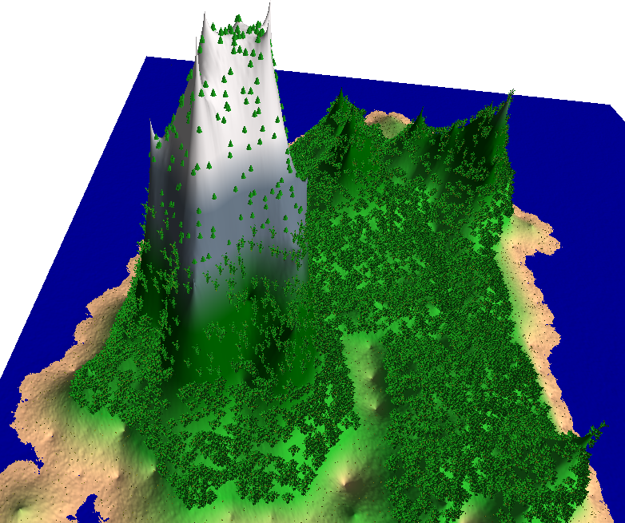
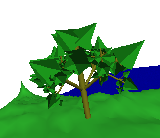
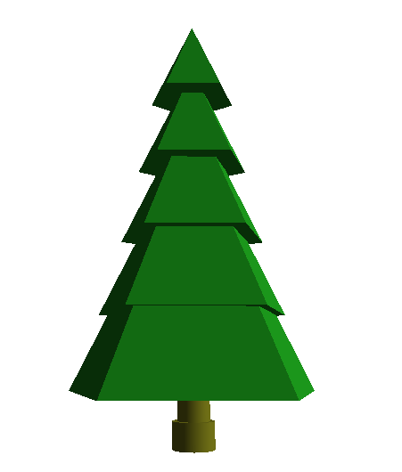
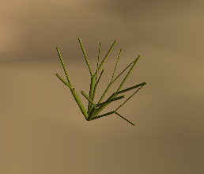
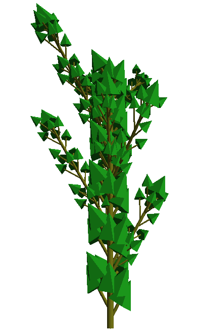
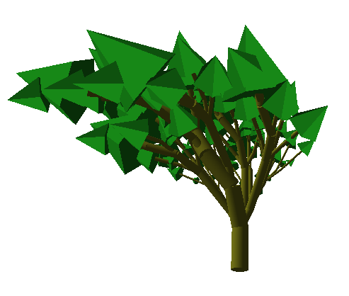
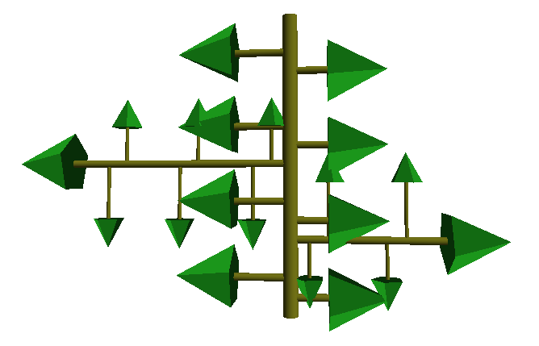
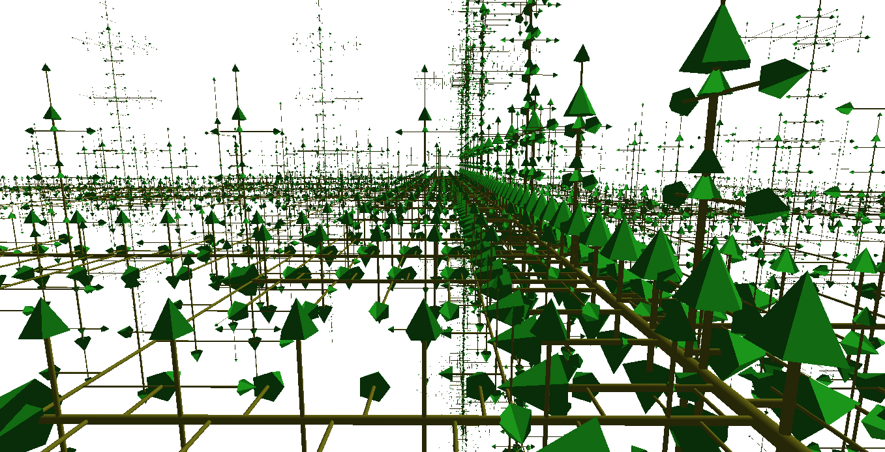

# AdvancedGraphicsFinalProject
Final Project

## Advanced Graphics Final Project, Combining L-Systems with Proceedural Terrain Generation.
L-Systems were used to make trees and vegetation to populate the generated terrain.

## Images
### Island with Vegetation

### Trees

### Accidental Images
While not directly related to the project, these are still interesting to look at.

